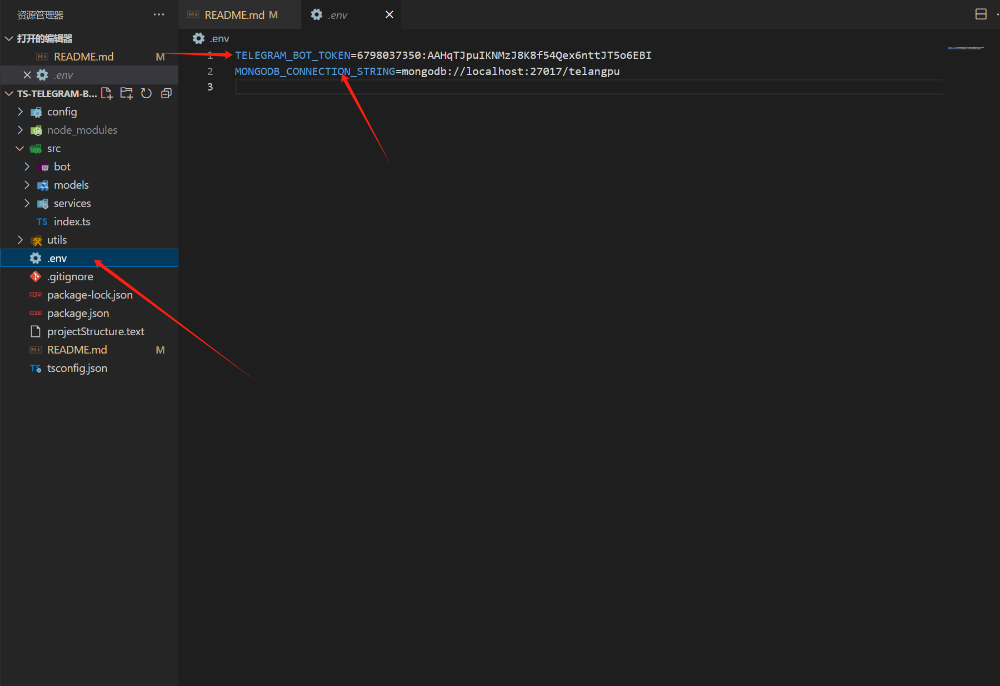
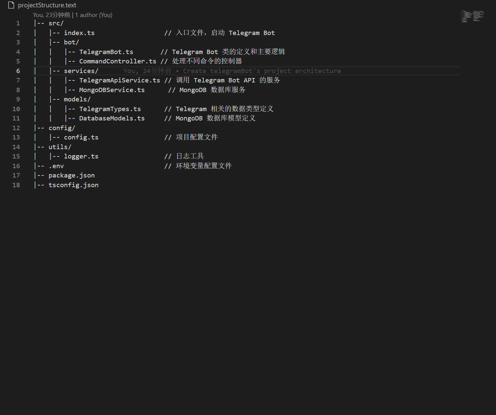

# TS-telegram-bot-framework

TS+node.js 开发电报机器人的架构，适用于中大型 telegram 机器开发

使用前请将.env 文件中的 TELEGRAM_BOT_TOKEN 值设置为你的 telegramBot 的 token
使用前请将.env 文件中的 MONGODB_CONNECTION_STRING 值设置为你的 mongodb 数据库的连接 URL

项目架构说明：

|-- src/
| |-- index.ts // 入口文件，启动 Telegram Bot
| |-- bot/
| | |-- TelegramBot.ts // Telegram Bot 类的定义和主要逻辑
| | |-- CommandController.ts // 处理不同命令的控制器
| |-- services/
| | |-- TelegramApiService.ts // 调用 Telegram Bot API 的服务
| | |-- MongoDBService.ts // MongoDB 数据库服务
| |-- models/
| | |-- TelegramTypes.ts // Telegram 相关的数据类型定义
| | |-- DatabaseModels.ts // MongoDB 数据库模型定义
|-- config/
| |-- config.ts // 项目配置文件
|-- utils/
| |-- logger.ts // 日志工具
|-- .env // 环境变量配置文件
|-- package.json
|-- tsconfig.json

如果看不懂可以在我的 Youtuber 频道观看视频讲解项目架构的使用方法
Youtuber 频道连接 www.youtube.com/@user-jp4wk4en4o

项目全局安装命令 npm install
项目启动命令 npm start
Start the project:

bash
Copy code
npm start
